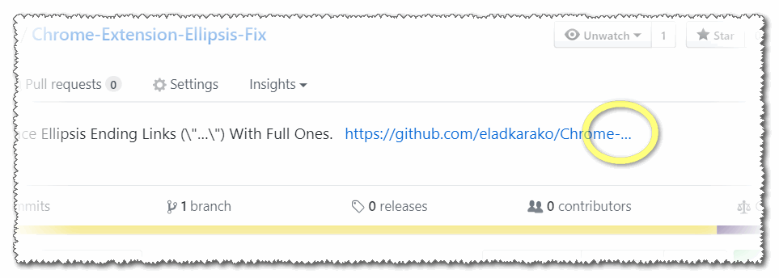
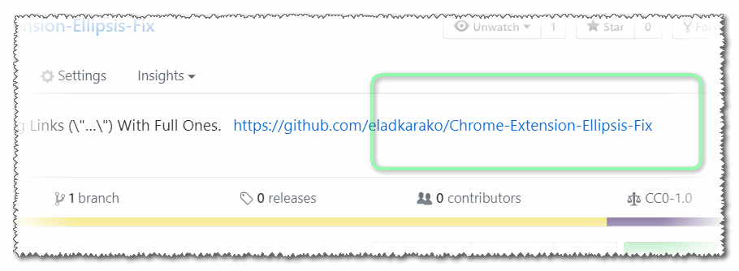

<h1>  Chrome-Extension-Ellipsis-Fix &nbsp; </h1>

<h2>★★★★★ Replace Ellipsis Ending Links (\"…\") With Full Ones.</h2>

<pre>
Developer's HUB / Changelog

1.0.1.3
* only format a "looks like a link" links.
+ include '...' variation.
+ support dynamic page-content (SPF and such...).

1.0.1.2
+ initial.

</pre>

