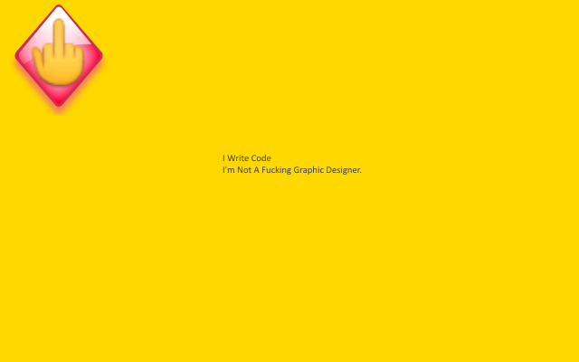

<h1> Chrome-Extension-Popup-🖕 &nbsp; </h1>

You = Safe. Pop-Ups = 🖕︎!

<pre>
Developer's HUB / Changelog

1.0.2.1
+ disables HTML5 history-api, to make browsers fallback into normal browsing.

1.0.1.1
+ why block some evil things

1.0.0.7
+ exclude my domains and Google domains (did you know that gmail uses document.write ... :/ )

1.0.0.5
+ initial.
</pre>

